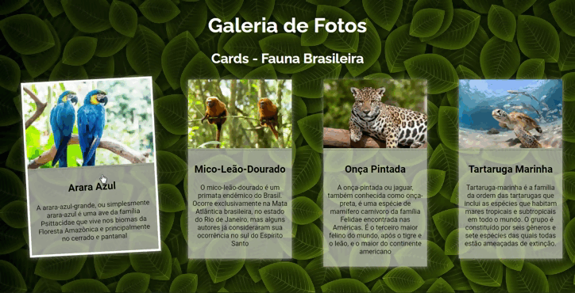

# Galeria-de-Fotos-com-Cards
Galeria de fotos organizadas como Cards informativos.   Projeto prático com HTML e CSS realizado com base no aprendizado da vídeo aula do Canal do Oscar Tenorio no Youtube. 
Basicamente foi criada uma div para cada foto que estará presente na galeria, seguida de um título de sessão de nível 2 e um elemento parágrafo para conter as informações relacionadas a foto.
Na estilização com CSS, foram importadas as fontes Roboto e Raleway do GoogleFonts, e para o hover foi aplicado transition e transform.

<a href="https://guilherme-rsm.github.io/Galeria-de-Fotos-com-Cards/">Clique aqui para vizualizar no Github Pages</a>

